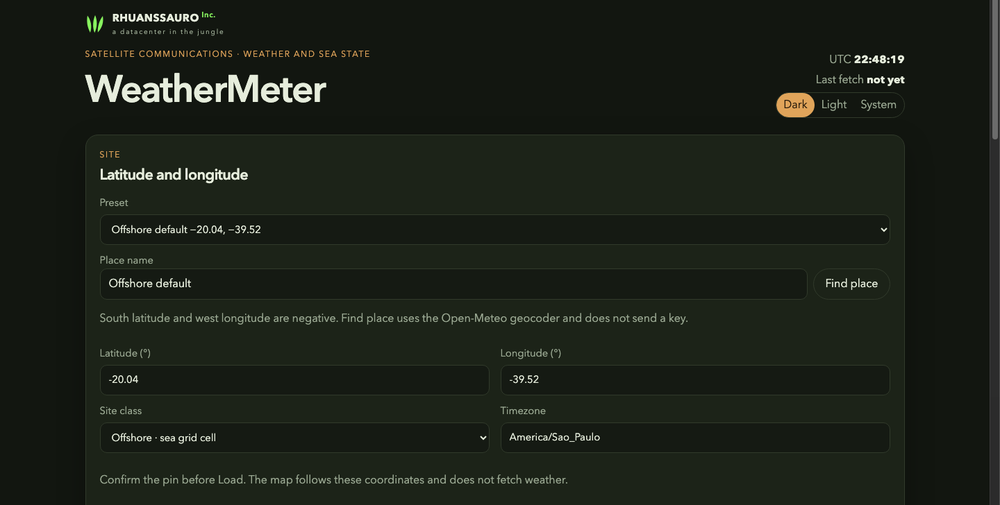
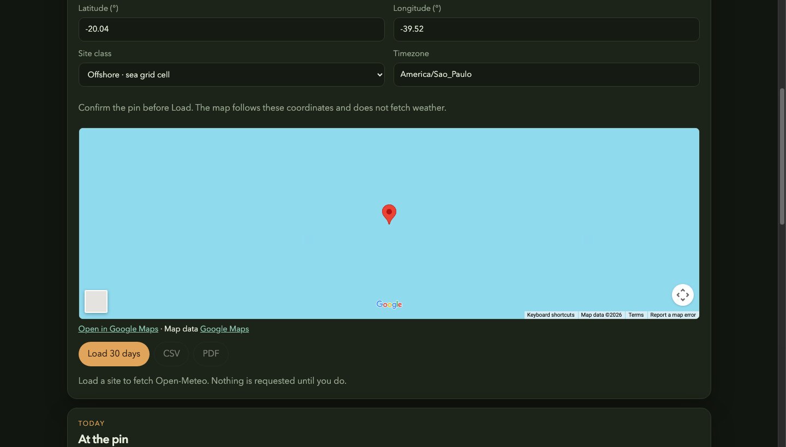
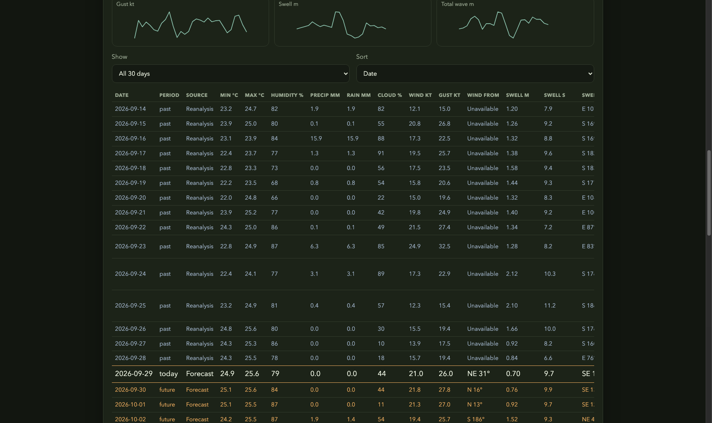

# WeatherMeter

WeatherMeter loads weather and sea state for one latitude and longitude, for personal use. Each load covers the 15 days before today and today through the next 14 days. You can save that window as CSV or as PDF.

The page is for offshore and onshore sites. Condition flags mark rain, cloud, gusts, thunderstorms, and offshore sea state. They are not a link budget, and they are not a navigation aid. Missing values stay **Unavailable**. Nothing is fetched until you press **Load 30 days**.

The page opens on an offshore example, latitude -20.04, longitude -39.52. Times use America/Sao_Paulo. South latitude and west longitude are negative. Type any site you are allowed to look up.








1. Choose a preset, or type a place and use **Find place**. A comma is accepted as the decimal mark (`-20,04`).
2. Choose Offshore (sea grid cell), Onshore (land weather cell), or Nearest. Swell and total wave still come from the sea cell for Offshore and Onshore.
3. Select **Load 30 days**.

| Period | What is requested | Label in the table |
| --- | --- | --- |
| 15 days before today | Forecast API `past_days=15` | Archived forecast |
| Those same past days, when the archive host answers | Historical Weather API | Reanalysis |
| Today and the next 14 days | Forecast API `forecast_days=15` | Forecast |
| Waves and swell, when the marine host answers | Marine API | Marine forecast |

Reanalysis is a model reconstruction, not a sensor at the pin. A missing value is not filled in from another series. The rest of the columns, the condition thresholds, and CSV and PDF behavior are in [instructions](instructions/README.md).

## Open-Meteo

Weather and sea state on this page are provided by [Open-Meteo](https://open-meteo.com/). Thank you to Open-Meteo for a free forecast, marine, historical, and geocoding API that a personal project can call without an account or an API key.

This repository is for personal, non-commercial use: a private page on your own machine, with no subscription and no advertising. Their terms are at https://open-meteo.com/en/terms. A website with ads, a paid product, or a service you sell is commercial use and needs their paid API. This project does not call those hosts and does not contain a key.

The data licence is [CC BY 4.0](https://open-meteo.com/en/licence). The page, the CSV, and the PDF carry the line **Weather data by Open-Meteo.com**. Keep that attribution if you copy a table into a note.

One load is two calls when the marine host answers, and three when the historical host also answers. Nothing polls in the background.

## Run

Python dependencies are in `requirements.txt`. The server uses the Python 3.9+ standard library only, so that file installs no packages:

```bash
python3 -m pip install -r requirements.txt
python3 serve.py
```

Open http://127.0.0.1:8766/. The server listens on this computer only. Stop it with Ctrl+C.

Node.js dependencies are in `package.json`. The only package is TypeScript 5.9.2, used to rebuild `src/` and run tests. Node.js 22 or newer:

```bash
npm install
npm test
```

An optional Linux host is described in [instructions/run-and-test.md](instructions/run-and-test.md).

## License

[MIT](LICENSE).
